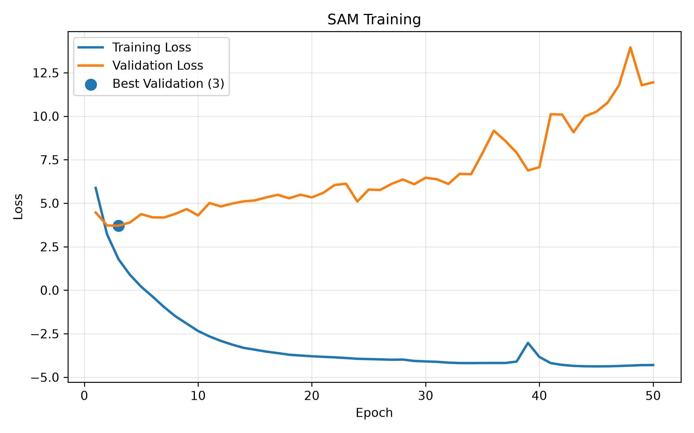
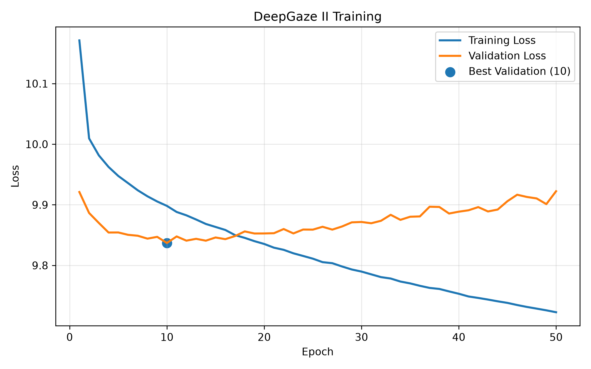

<!-- 
#TODO: ROC-AUC Comparison of all models (updated code is in cvcp20)

Go to the folder where scripts and data is:

1) Create virtual environment and install dependencies
  
2) Train via: 
``python3 train.py --data-root ../cv2_project_data --model_name FCN-resnet50 / deepgaze2 / SAM``

3) Create predictions via:
``python3 predict_test.py   --data-root ../cv2_project_data  --model_name FCN-resnet50 / deepgaze2 / SAM   --save-dir test_predictions``

FCN Resnet50:
Input image : [B, 3, 224, 224] -> FCN ResNet-50 -> Raw logits : [B, 1, 224, 224] -> Gaussian smoothing : [B, 1, 224, 224] -> Add log center bias : [B, 1, 224, 224] -> Final fixation logits : [B, 1, 224, 224]

^ uses BCE loss

<br>
<br>

DeepGaze2 Like: <br>
https://arxiv.org/pdf/1610.01563 <br>
Input image : [B, 3, 224, 224] -> Frozen VGG-19 feature extractor -> Selected VGG features:
      conv5_1 : [B, 512, 14, 14] <br>
      relu5_1 : [B, 512, 14, 14] <br>
      relu5_2 : [B, 512, 14, 14] <br>
      conv5_3 : [B, 512, 14, 14] <br>
      relu5_4 : [B, 512, 14, 14] <br>


-> Upsampling: each feature map: [B, 512, 14, 14] -> [B, 512, 112, 112]

-> Concatenation: 5 maps × 512 channels = [B, 2560, 112, 112]

-> Readout network:
      [B, 2560, 112, 112] <br>
      -> [B, 16, 112, 112] <br>
      -> [B, 32, 112, 112] <br>
      -> [B, 2, 112, 112] <br>
      -> [B, 1, 112, 112] <br>

-> Raw fixation logits: [B, 1, 112, 112] -> Upsample to orig img size: [B, 1, 224, 224] -> Gaussian smoothing: [B, 1, 224, 224]  -> Add log center bias: [B, 1, 224, 224] -> Final fixation logits: [B, 1, 224, 224]


^^ uses DeepGaze II likelihood loss

-->


<div align="center">

# 👁️ Eye Fixation Prediction
### Benchmarking Deep Saliency Models - SAM vs. DeepGaze II vs. FCN-ResNet50


*Comparing how three deep learning architectures predict where a human eye will look in an image.*

</div>

---

## 🎯 Overview

Visual saliency prediction estimates the regions of an image that naturally draw human attention making it useful in robotics, image compression, autonomous systems, UX research, and human-computer interaction.

This project implements, trains, and evaluates **three** deep saliency models under an identical preprocessing and evaluation pipeline, then compares them quantitatively using the **AUC-Judd** metric:

- **SAM** (Saliency Attentive Model) — CNN + attentive ConvLSTM
- **DeepGaze II** — frozen VGG-19 features + a learned readout network
- **FCN-ResNet50** — a fully convolutional baseline

> 📚 Group project for *Computer Vision 2*, University of Hamburg — with [Aqsa Mohsin](https://github.com/AQSAMOHSIN).

---

## 🧠 Models

<details>
<summary><strong>SAM - Saliency Attentive Model</strong></summary>

A CNN backbone feeds an **attentive Convolutional LSTM** that iteratively refines the saliency map over several steps, combined with learned Gaussian center-bias priors.

```
Input image [B, 3, 224, 224]
  → CNN feature extractor
  → Attentive ConvLSTM (iterative refinement)
  → + learned Gaussian center-bias priors
  → Final saliency map [B, 1, 224, 224]

Loss:  L_SAM = 10·L_KL − 2·L_CC − L_NSS
```
Reference: Cornia et al., *"Predicting Human Eye Fixations via an LSTM-based Saliency Attentive Model,"* IEEE TIP 2018 ([arXiv:1611.09571](https://arxiv.org/abs/1611.09571)).
</details>

<details>
<summary><strong>DeepGaze II</strong></summary>

Extracts high-level features from a **frozen VGG-19**, then trains only a lightweight readout network on top.

```
Input image [B, 3, 224, 224]
  → Frozen VGG-19 (conv5_1, relu5_1, relu5_2, conv5_3, relu5_4)
  → Upsample each map to 112×112, concat → [B, 2560, 112, 112]
  → Readout net: 2560 → 16 → 32 → 2 → 1 channels
  → Upsample to 224×224 → Gaussian smoothing + log center bias
  → Final fixation logits [B, 1, 224, 224]

Loss:  DeepGaze II likelihood loss
```
Reference: Kümmerer et al., *"DeepGaze II: Reading fixations from deep features trained on object recognition,"* ([arXiv:1610.01563](https://arxiv.org/pdf/1610.01563)).
</details>

<details>
<summary><strong>FCN-ResNet50 (baseline)</strong></summary>

```
Input image [B, 3, 224, 224]
  → FCN ResNet-50 backbone
  → Raw logits [B, 1, 224, 224]
  → Gaussian smoothing + log center bias
  → Final fixation logits [B, 1, 224, 224]

Loss:  Binary Cross-Entropy (BCE)
```
</details>

---

## 🗂️ Dataset

A paired image / eye-fixation-density-map dataset (`cv2_project_data`), loaded through a custom PyTorch `Dataset`. Images and fixation maps are resized to 224×224, normalized with ImageNet statistics for the CNN backbones, and unnormalized copies are kept for visualization.

> ℹ️ This is course-provided data 

## ⚙️ Training Setup

| | |
|---|---|
| Optimizer | AdamW |
| Learning rate | 1e-4 |
| Batch size | 8 |
| Weight decay | 1e-4 |
| Epochs | 50 (best checkpoint kept by validation loss) |

---

## 📊 Results

Evaluated on a held-out test set of **1,128 images**, AUC-Judd metric:

| Model | Mean AUC-Judd | Median AUC-Judd | Std. Dev. |
|---|:---:|:---:|:---:|
| **SAM** | **0.891** | **0.916** | 0.088 |
| DeepGaze II | 0.874 | 0.896 | 0.087 |
| FCN-ResNet50 | *in progress* | *in progress* | — |

**Training behavior:** SAM's validation loss bottoms out fast (epoch 3) and then overfits, while DeepGaze II improves more gradually and keeps a smaller train/validation gap (best epoch ≈10) - SAM wins on raw AUC-Judd, but DeepGaze II generalizes more predictably.






---

## 📁 Repo structure

```
Eye-fixation-prediction/
├── SAM/                  # SAM model implementation
├── DeepGaze2/             # DeepGaze II model implementation
├── FCN_with_Resnet50/     # FCN-ResNet50 baseline implementation
├── train.py               # training entrypoint
├── predict_test.py        # generate predictions on the test set
├── auc_score.py            # AUC-Judd evaluation
├── dataset.py              # PyTorch Dataset / preprocessing
├── configs.yaml             # run configuration
├── extra.py
└── .gitignore
```

## 🚀 Quickstart

```bash
# 1. Set up environment
python3 -m venv .venv && source .venv/bin/activate
pip install torch torchvision numpy opencv-python pillow pyyaml
# (add a requirements.txt with these pinned so this is one command)

# 2. Train a model — model_name: SAM | deepgaze2 | FCN-resnet50
python3 train.py --data-root ../cv2_project_data --model_name SAM

# 3. Generate predictions on the test set
python3 predict_test.py --data-root ../cv2_project_data --model_name SAM --save-dir test_predictions

# 4. Compute AUC-Judd (see auc_score.py for arguments)
python3 auc_score.py
```

---

## 📚 References
- Cornia et al., *Predicting Human Eye Fixations via an LSTM-based Saliency Attentive Model*, IEEE TIP 2018 - [arXiv:1611.09571](https://arxiv.org/abs/1611.09571)
- Kümmerer et al., *DeepGaze II: Reading fixations from deep features trained on object recognition* - [arXiv:1610.01563](https://arxiv.org/pdf/1610.01563)

## 👥 Authors
**Laiba Qureshi** & **Aqsa Mohsin** - Computer Vision 2, University of Hamburg

